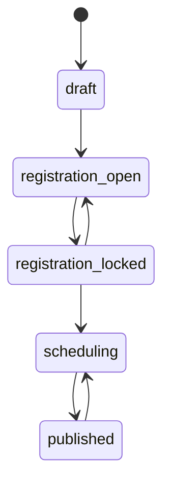

# GogiCalendar Business Rules

## 1. Canonical contract decisions

When source documents conflict, the MVP uses these values:

| Concern              | Canonical MVP rule                         |
| -------------------- | ------------------------------------------ |
| User role            | `manager` or `employee`                    |
| Shift type           | `work`, `off`, or `leave`                  |
| Preferences DTO      | `EmployeePreference[]`                     |
| Forecast DTO         | `{ [dayLabel]: { [department]: number } }` |
| Stored dates         | BSON `Date` in UTC                         |
| API date-only values | `YYYY-MM-DD`                               |
| Employee public ID   | API `id`, DB `employeeId`                  |

`staff` from the older specification maps to `employee`. No API response returns `staff`.

## 2. Authentication

### Manager

- Logs in with username and password.
- Password is stored only as a strong hash.
- Disabled credentials, inactive employees, and active lockouts cannot log in.
- Demo credentials are seed data sourced from environment variables.

### Employee

- Logs in with employee ID or normalized phone.
- The identifier must resolve to exactly one active employee.
- No password is required in the current product contract.
- This endpoint receives stricter IP and identifier rate limits and always emits an audit event.
- Phone normalization removes every non-digit character.

### Sessions

- Access tokens are short-lived.
- Refresh tokens are rotated.
- Only refresh token hashes are stored.
- Reuse of a rotated token revokes its token family.
- Logout revokes the presented refresh token or family according to endpoint semantics.
- Passwords and raw tokens are never written to logs or audit metadata.

## 3. Employee rules

- `employeeId` is immutable after creation in MVP.
- `phone` is normalized before uniqueness checks.
- A HUB employee without an ID receives `HUB_<timestamp>_<random>`.
- Role is `manager` or `employee`.
- Status is `active` or `inactive`.
- Inactive employees cannot log in, submit preferences, or receive new assignments.
- Existing historical schedules continue to display inactive employees by their stored business ID. API enrichment may use the current employee record.
- Employees referenced by schedules are not hard-deleted.
- Skills are a boolean map. Missing and false both mean the employee does not have that skill.

## 4. Shift rules

- Shift codes are trimmed and uppercased.
- Codes are unique and immutable once referenced; renaming requires creating a new code and disabling the old one.
- `breakMinutes` is an integer greater than or equal to zero.
- Time uses `HH:mm`.
- `work` shifts require `startTime` and `endTime`.
- `isSplit=true` requires `startTime2` and `endTime2`.
- `isSplit=false` stores second interval values as null.
- `off` and `leave` do not contribute to staffing counts.
- Referenced shifts are disabled instead of hard-deleted.

## 5. Weekly schedule

- `weekId` uses ISO week format `YYYY-Www`.
- A week begins Monday and ends Sunday.
- Start and end dates are derived and validated server-side.
- Weekly ranges may not overlap.
- New schedules start as `draft`.
- `create-next` uses ISO week/date calculations, including week 53 and year boundaries.
- All embedded preference, assignment, and forecast dates must fall inside the schedule.

### State machine



Any transition outside this graph returns `409 INVALID_STATUS_TRANSITION`.

### Visibility

- Managers can read every schedule and all embedded data.
- Employees can read published schedules including the public roster.
- During `registration_open`, an employee can read schedule metadata, shifts needed by the form, and only that employee's preference. Unpublished assignments and other employees' preferences are omitted.
- In `draft`, `registration_locked`, and `scheduling`, employees cannot read the unpublished roster.
- Published roster visibility is restaurant-wide according to the current FE. A future privacy mode can restrict it without changing storage.

## 6. Preferences

- Employees can read and write only their own preference.
- Employee writes are allowed only while status is `registration_open` and before `registrationDeadline` when configured.
- PUT replaces the employee's complete seven-day preference set.
- Each date appears at most once.
- Type is `available`, `preferred`, or `unavailable`.
- `preferred` requires an active `work` shift code.
- `available` and `unavailable` must not carry `preferredShift`.
- Notes are trimmed and length-limited.
- Manager override is allowed at any status, requires a reason, and creates an audit log.
- One preference subdocument exists per employee per week.

## 7. Assignments

- Only managers write assignments.
- Writes are allowed in `registration_locked`, `scheduling`, and `published`.
- The first scheduling write from `registration_locked` moves the week to `scheduling`.
- Editing a published week moves it back to `scheduling`; republishing is explicit.
- Employee must exist and be active for new assignments.
- Shift code must exist and be active.
- Assignment date must belong to the week.
- MVP permits at most one assignment per employee per date.
- An employee may have a primary and secondary role.
- Missing role skill produces a warning, not a hard failure.
- Off/leave assignments are retained for roster display but excluded from staffing.

## 8. Forecast and staffing

- MVP forecast values are non-negative integers by date and department/group.
- Storage supports optional `slotStart` and `slotEnd` for future detailed forecast.
- Variance is `actual - target`.
- Negative is understaffed, zero is sufficient, positive is overstaffed.
- Empty shifts and shift types `off`/`leave` do not count.

Overlap uses half-open intervals:

```text
max(shiftStart, slotStart) < min(shiftEnd, slotEnd)
```

- Overnight intervals add 1440 minutes to the end.
- Split intervals are checked independently.
- A person counts once per requested slot even if two split intervals unexpectedly overlap it.

## 9. Concurrency and idempotency

- Every schedule mutation includes the last known `version`.
- The service updates using `{ weekId, version }` and increments version atomically.
- No match returns `409 VERSION_CONFLICT` with the current resource version when safe.
- Bulk replacement endpoints are idempotent for the same body and version sequence.
- Creation endpoints reject duplicate business identifiers with `409 RESOURCE_CONFLICT`.

## 10. Audit rules

Audit at minimum:

- Login success/failure, refresh, logout, token reuse.
- Employee create/update/status.
- Shift create/update/status.
- Schedule create and status transition.
- Manager preference override.
- Assignment and forecast changes.
- Published schedule edits.

Sensitive values are redacted. Audit logs are append-only through application APIs.

## 11. Authorization matrix

Legend: Public, Self, Authenticated, Manager, Denied.

| Endpoint                          | Anonymous                 | Employee                                  | Manager                            |
| --------------------------------- | ------------------------- | ----------------------------------------- | ---------------------------------- |
| `GET /api/health`                 | Public                    | Public                                    | Public                             |
| `GET /api/ready`                  | Public                    | Public                                    | Public                             |
| `POST /api/auth/login/manager`    | Public                    | Public                                    | Public                             |
| `POST /api/auth/login/employee`   | Public                    | Public                                    | Public                             |
| `POST /api/auth/refresh`          | Public with refresh token | Same                                      | Same                               |
| `POST /api/auth/logout`           | Denied                    | Authenticated                             | Authenticated                      |
| `GET /api/auth/me`                | Denied                    | Self                                      | Self                               |
| `GET /api/employees`              | Denied                    | Denied                                    | Manager                            |
| `GET /api/employees/:id`          | Denied                    | Self only                                 | Manager                            |
| Employee mutations                | Denied                    | Denied                                    | Manager                            |
| `GET /api/shifts`                 | Denied                    | Authenticated active only                 | Manager                            |
| Shift mutations                   | Denied                    | Denied                                    | Manager                            |
| `GET /api/schedules`              | Denied                    | Published/registration-visible projection | Manager                            |
| `GET /api/schedules/:weekId`      | Denied                    | Visibility projection                     | Manager                            |
| Schedule create/status            | Denied                    | Denied                                    | Manager                            |
| `GET/PUT .../preferences/me`      | Denied                    | Self                                      | Manager acting as self is not used |
| `GET .../preferences`             | Denied                    | Denied                                    | Manager                            |
| `PUT .../preferences/:employeeId` | Denied                    | Denied                                    | Manager with reason                |
| Assignment mutations              | Denied                    | Denied                                    | Manager                            |
| Forecast mutation                 | Denied                    | Denied                                    | Manager                            |
| Staffing summary                  | Denied                    | Denied                                    | Manager                            |
| Schedule validation               | Denied                    | Denied                                    | Manager                            |
| Audit log list                    | Denied                    | Denied                                    | Manager                            |

## 12. Error codes

| HTTP | Code                        | Use                                       |
| ---- | --------------------------- | ----------------------------------------- |
| 400  | `VALIDATION_ERROR`          | Invalid body/query/path                   |
| 401  | `AUTHENTICATION_REQUIRED`   | Missing/invalid access token              |
| 401  | `INVALID_CREDENTIALS`       | Login failure without account disclosure  |
| 403  | `FORBIDDEN`                 | Valid identity without permission         |
| 404  | `RESOURCE_NOT_FOUND`        | Resource absent or hidden                 |
| 409  | `RESOURCE_CONFLICT`         | Duplicate ID, phone, code, or week        |
| 409  | `INVALID_STATUS_TRANSITION` | Invalid schedule transition               |
| 409  | `VERSION_CONFLICT`          | Optimistic concurrency failure            |
| 422  | `BUSINESS_RULE_VIOLATION`   | Valid syntax but invalid domain operation |
| 429  | `RATE_LIMITED`              | Too many requests                         |
