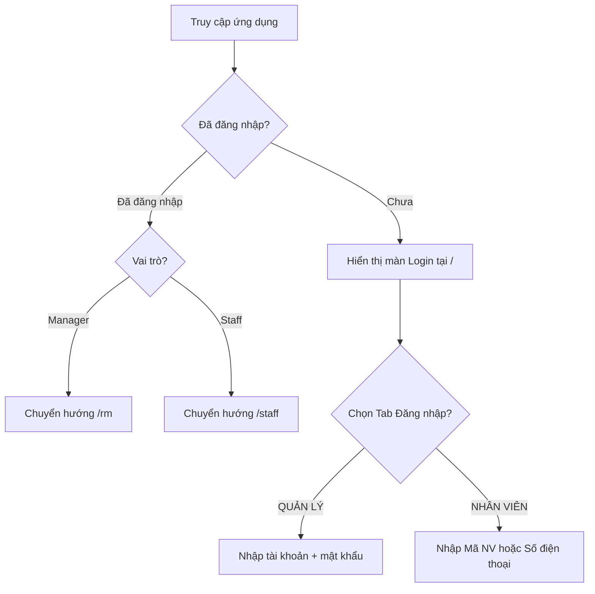
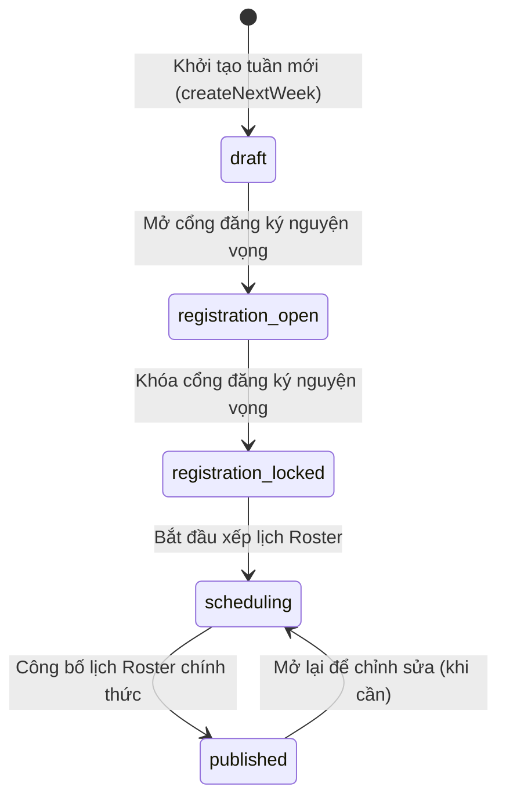

# GogiCalendar - Tài Liệu Đặc Tả Kỹ Thuật Cho Backend (Backend Specification)

Tài liệu này tổng hợp các quy chuẩn dữ liệu, logic nghiệp vụ (business logic) và luồng hoạt động mà đội ngũ Backend (BE) cần tuân thủ để tích hợp đồng bộ với giao diện Frontend (FE).

---

## 1. Kiến Trúc Định Tuyến & Luồng Xác Thực (Authentication & Routing)

Ứng dụng phân chia giao diện và quyền hạn dựa trên đường dẫn URL và thông tin tài khoản:

### Vai Trò & Tài Khoản Demo

| Vai trò | Đường dẫn URL | Tài khoản đăng nhập | Mật khẩu | Giao diện hiển thị |
| :--- | :--- | :--- | :--- | :--- |
| **Quản lý (Manager)** | `/rm` | `rm4650` | `123456789` | Full sidebar, quản lý nhân sự, ca làm việc, xếp lịch trực, cài đặt dự trù, duyệt/công bố lịch. |
| **Nhân viên (Staff)** | `/staff` | Mã nhân viên *hoặc* Số điện thoại | *Không cần mật khẩu* | Ẩn sidebar, chỉ hiển thị tab Lịch cá nhân (đăng ký nguyện vọng) và Lịch tổng. |



---

## 2. Đặc Tả Dữ Liệu & Schemas

Các đối tượng dữ liệu chính bao gồm: **Nhân viên (Employee)**, **Ca làm việc (ShiftCode)**, và **Lịch làm việc tuần (WeeklySchedule)**.

### 2.1. Nhân viên (Employee)

Quản lý thông tin hồ sơ của nhân sự nhà hàng.

* **HUB Personnel:** Nhân sự thuộc nhóm HUB là nhân sự độc lập, **không bắt buộc nhập Mã nhân viên (ID)**.
  * Nếu không nhập ID, hệ thống tự sinh ID theo định dạng: `HUB_[timestamp]_[random]`.
* **Số điện thoại:** Phải được chuẩn hóa và loại bỏ toàn bộ dấu chấm trước khi lưu (ví dụ: `0357516001` thay vì `0357.516.001`).

```json
{
  "id": "1054413", 
  "name": "Hoàng Đức Hữu",
  "phone": "0824678226",
  "role": "manager", 
  "level": "RM",
  "scheduleGroup": "BAN QUẢN LÝ",
  "primaryDepartment": "Quản lý",
  "skills": {
    "Order": true,
    "Phục vụ": true
  },
  "status": "active"
}
```

#### Chi tiết các trường dữ liệu:
* `role`: Chỉ nhận giá trị `"manager"` hoặc `"staff"`.
* `level`: Phân cấp kỹ năng bao gồm:
  * Nhân sự độc lập: `New`, `HUB`.
  * Nhân sự chính thức (S1 - S3): `S1.1`, `S1.2`, `S1.3`, `S2.1`, `S2.2`, `S2.3`, `S3.1`, `S3.2`, `S3.3`.
  * Ban quản lý: `RM`, `QLC`, `Trưởng ca`.
* `skills`: Chỉ lưu dưới dạng key-value boolean thể hiện biết làm (`true`) hoặc không biết làm (không gửi key hoặc `false`). Không chia cấp độ kỹ năng.
* `status`: `"active"` (đang làm việc) hoặc `"inactive"` (đã nghỉ).

---

### 2.2. Ca Làm Việc (ShiftCode)

Định nghĩa khung thời gian của các ca làm việc trong nhà hàng.

```json
{
  "code": "S20",
  "name": "08:00-18:00 (Split)",
  "startTime": "08:00",
  "endTime": "13:30",
  "breakMinutes": 30,
  "type": "work",
  "color": "sky",
  "isSplit": true,
  "startTime2": "17:00",
  "endTime2": "21:30"
}
```

#### Chi tiết các trường dữ liệu:
* `isSplit`: Xác định ca gãy (ca chia làm 2 ca nhỏ trong ngày).
* Nếu `isSplit` là `true`, bắt buộc phải có `startTime2` và `endTime2`. Nếu `false`, hai trường này là `null`.
* `type`: `"work"` (ca đi làm) hoặc `"off"` (ca nghỉ).

---

### 2.3. Lịch làm việc tuần (WeeklySchedule)

Thực thể cốt lõi chứa toàn bộ phân bổ lịch trực, nguyện vọng nhân viên và số lượng dự trù khách hàng cho một tuần cụ thể.

```json
{
  "weekId": "2026-W25",
  "startDate": "2026-06-15",
  "endDate": "2026-06-21",
  "status": "published",
  "assignments": {
    "Thứ 2": [
      {
        "employeeId": "1054413",
        "shiftCode": "S20",
        "primaryRole": "Order"
      }
    ]
  },
  "preferences": {
    "0198393": {
      "employeeId": "0198393",
      "dayPreferences": {
        "Thứ 2": {
          "type": "preferred",
          "preferredShift": "P22",
          "note": "Xin ca tối đi học"
        }
      }
    }
  },
  "forecast": {
    "Thứ 2": {
      "08H-09H": 5,
      "09H-10H": 10
    }
  }
}
```

---

## 3. Quy trình Trạng thái Lịch (Schedule State Machine)

Lịch tuần di chuyển tuần tự qua 5 trạng thái dưới sự điều khiển của Quản lý:



1. **`draft` (Nháp):** Tuần mới được khởi tạo tự động dựa trên ngày kết thúc của tuần trước đó + 1 ngày.
2. **`registration_open` (Mở đăng ký):** Nhân viên có thể đăng nhập để gửi nguyện vọng thời gian rảnh/bận (`preferences`).
3. **`registration_locked` (Khóa cổng):** Nhân viên không thể thay đổi nguyện vọng nữa. Quản lý chuẩn bị xếp lịch.
4. **`scheduling` (Đang xếp ca):** Quản lý thực hiện phân ca trực tiếp trên bảng lưới ExcelGrid. Nhân viên chưa thể xem lịch chính thức.
5. **`published` (Đã công bố):** Lịch chính thức được công bố. Nhân viên được phép xem lịch cá nhân và lịch tổng của nhà hàng.

---

## 4. Logic Nghiệp Vụ Quan Trọng (Business Logic)

### 4.1. Logic tính toán trùng khớp khung giờ (Overlap Calculation)

Để đếm số lượng nhân sự có mặt trong mỗi khung giờ trên Timeline chi diện rộng (ví dụ: khung `17H-18H`), Backend cần áp dụng đúng thuật toán quy đổi giờ thành phút và tính giao thoa như Frontend đang thực hiện:

#### Thuật toán:
1. Quy đổi thời gian Start/End của ca làm việc và khung giờ (Slot) thành số phút tính từ 00:00.
2. Xử lý trường hợp **ca qua đêm (Overnight)**: Nếu `endTime < startTime`, cộng thêm `24 * 60` (1440 phút) vào `endTime`.
3. Xử lý **ca gãy (Split Shift)**: Nếu ca đó có `isSplit === true`, kiểm tra độc lập cho cả hai khoảng thời gian `(startTime, endTime)` và `(startTime2, endTime2)`. Nhân viên được coi là có mặt nếu trùng khớp với bất kỳ khoảng nào trong hai khoảng này.
4. **Công thức giao thoa:** Khoảng ca làm việc `[shiftStart, shiftEnd]` giao thoa với khung giờ `[slotStart, slotEnd]` khi và chỉ khi:
   $$\max(\text{shiftStart}, \text{slotStart}) < \min(\text{shiftEnd}, \text{slotEnd})$$

*Mã nguồn mẫu tham khảo từ Frontend:*
```typescript
function isShiftOverlappingSlot(shift: ShiftCode, slotStartStr: string, slotEndStr: string): boolean {
  const parseTimeToMinutes = (t: string) => {
    const [h, m] = t.split(':').map(Number);
    return h * 60 + m;
  };

  const slotStart = parseTimeToMinutes(slotStartStr);
  const slotEnd = parseTimeToMinutes(slotEndStr);

  const checkOverlap = (startStr: string, endStr: string) => {
    if (!startStr || !endStr) return false;
    let start = parseTimeToMinutes(startStr);
    let end = parseTimeToMinutes(endStr);
    if (end < start) end += 24 * 60; // Ca qua đêm
    return Math.max(start, slotStart) < Math.min(end, slotEnd);
  };

  if (shift.isSplit) {
    return checkOverlap(shift.startTime, shift.endTime) || 
           checkOverlap(shift.startTime2 || '', shift.endTime2 || '');
  }
  return checkOverlap(shift.startTime, shift.endTime);
}
```

---

## 5. Danh sách các API cần xây dựng (API Endpoints Draft)

### 5.1. Xác thực & Phân quyền
* `POST /api/auth/login`
  * Body (Manager): `{ "username": "rm4650", "password": "..." }`
  * Body (Staff): `{ "employeeIdOrPhone": "..." }`
  * Response: Token JWT cùng thông tin Profile cá nhân kèm theo role (`manager`/`staff`).

### 5.2. Quản lý Nhân sự (Employees)
* `GET /api/employees` (Hỗ trợ query filter theo `search`, `level`, `scheduleGroup`, `status`).
* `POST /api/employees` (Tạo mới nhân viên, chuẩn hóa SĐT, tự động sinh ID cho HUB nếu để trống).
* `PUT /api/employees/:id` (Cập nhật nhân sự).

### 5.3. Quản lý Ca làm việc (Shifts)
* `GET /api/shifts`
* `POST /api/shifts`
* `PUT /api/shifts/:code`

### 5.4. Quản lý Lịch trực tuần (Schedules)
* `GET /api/schedules` (Trả về danh sách tất cả các tuần để chọn xem).
* `POST /api/schedules/create-next` (Tự động khởi tạo tuần tiếp theo từ ngày kết thúc của tuần mới nhất).
* `PUT /api/schedules/:weekId/status` (Cập nhật trạng thái tuần: nháp, mở đăng ký, khóa đăng ký, xếp ca, công bố).
* `PUT /api/schedules/:weekId/assignments` (Cập nhật bảng phân ca của tuần).
* `PUT /api/schedules/:weekId/preferences` (Nhân sự gửi nguyện vọng rảnh/bận trong tuần).
* `PUT /api/schedules/:weekId/forecast` (Cập nhật số liệu định biên dự trù khách hàng cho từng ngày/giờ).
