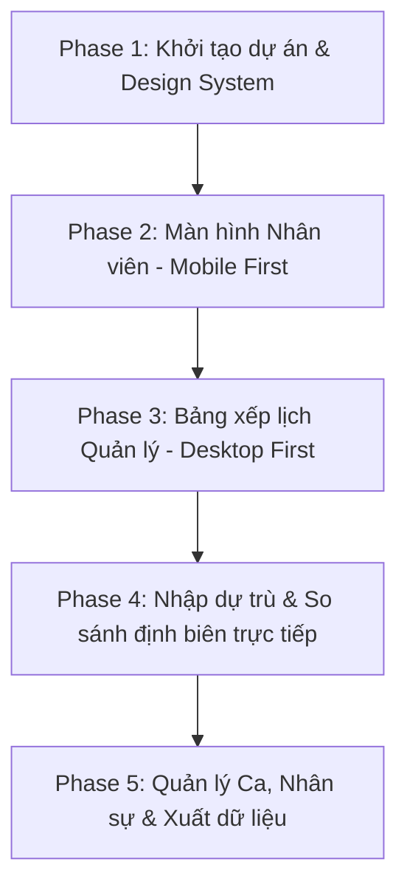

# Kế Hoạch Triển Khai Frontend GogiCalendar & Bộ Prompt Cho AI Agent

Tài liệu này cung cấp lộ trình phát triển chi tiết (Frontend-only với Mock Data) cho ứng dụng **GogiCalendar** - Hệ thống đăng ký nguyện vọng và xếp lịch làm việc cho nhà hàng. 

Bản kế hoạch này kết hợp trực tiếp các thiết lập từ các kỹ năng thiết kế và sản phẩm có sẵn trong workspace của bạn:
*   **Thiết lập thiết kế (Design Dials):** `DESIGN_VARIANCE: 6` (bố cục lưới rõ ràng, có sự linh hoạt nhẹ), `MOTION_INTENSITY: 3` (tối giản chuyển động, chỉ dùng micro-animations khi rê chuột/click chuột để tối ưu hiệu năng), `VISUAL_DENSITY: 7` (màn hình quản lý có mật độ thông tin cao, rõ ràng, sắp xếp khoa học dạng bảng).
*   **Kỹ năng sản phẩm:** `restaurant-schedule-product` (tập trung vào lịch tuần, phân biệt luồng nhân viên di động & quản lý máy tính, so sánh dự trù nhân sự).
*   **Quy tắc chống AI-Slop:** Không dùng em-dash, không dùng tên công ty/avatar/số liệu giả của AI, không có gradient tím mặc định của AI.

---

## 🛠️ Lựa Chọn Công Nghệ (Tech Stack)

Để tối ưu hóa tốc độ phát triển và đảm bảo hiệu năng:
1.  **Framework:** React + Vite (Fast, lightweight, SPA mượt mà).
2.  **CSS/Styling:** TailwindCSS v4 (Tiết kiệm class, dễ kiểm soát màu sắc).
3.  **Icons:** `@phosphor-icons/react` (Cho giao diện hiện đại và đồng bộ).
4.  **Animation:** `motion/react` (Cho các hiệu ứng chuyển đổi trạng thái nhẹ nhàng).
5.  **State Management (Mock):** Zustand (Lưu trữ lịch sử, trạng thái ca, nguyện vọng nhân viên, và đồng bộ dữ liệu giả lập cục bộ thông qua LocalStorage).

---
  
## 📅 Lộ Trình Phát Triển (Phases & Timelines)



---

## 📝 Chi Tiết Các Phase & Bộ Prompt Cho AI Agent

Dưới đây là bộ prompt chi tiết cho từng phase bằng tiếng Việt để bạn dán trực tiếp cho AI Agent thực hiện:

### 🌟 Phase 1: Setup Dự Án & Xây Dựng Khung Giao Diện (Design System & Shell)
*   **Mục tiêu:** Tạo cấu trúc thư mục, thiết lập TailwindCSS v4, thiết lập các biến màu sắc (bảng màu sáng tinh tế, màu cảnh báo xanh/đỏ/cam nhạt), cấu hình Router và Layout cơ bản của ứng dụng (Navigation và Sidebar cho quản lý).
*   **Thành phần chính:** `mockData.ts` (chứa dữ liệu mẫu về nhân viên, ca làm, lịch tuần trước/sau), `Layout.tsx`, `WeekSelector.tsx`.

#### 🤖 Prompt Phase 1: Copy-Paste cho AI Agent
```text
Hãy sử dụng kỹ năng `design-taste-frontend` và `restaurant-schedule-product` trong workspace để thiết lập khung dự án GogiCalendar (React + Vite + TailwindCSS v4 + Phosphor Icons + Zustand).

Hãy tuân thủ nghiêm ngặt các tham số thiết kế sau:
- DESIGN_VARIANCE: 6 (Lưới đồng đều, căn chỉnh thẳng thớm, bố cục bảng).
- MOTION_INTENSITY: 3 (Chỉ sử dụng hover/active cơ bản, transition mượt mà 150-200ms, không dùng các animation chạy vô tận).
- VISUAL_DENSITY: 7 (Mật độ thông tin cao, khoảng cách padding chặt chẽ, tối ưu diện tích hiển thị).
- Quy tắc nghiêm ngặt: KHÔNG được sử dụng ký tự em-dash làm ký tự phân tách hoặc trang trí (chỉ sử dụng dấu gạch ngang ngắn thường "-"). Không sử dụng văn bản giả lập AI hay tên công ty giả (như Acme, Nexus, SmartFlow).

Hãy triển khai các bước sau:
1. Tạo file dữ liệu mock `src/data/mockData.ts` gồm:
   - Danh sách nhân viên (ID, Họ tên, Bộ phận chính [FOH, BOH, Bar, Tạp vụ], Kỹ năng [Order, Phục vụ, Bar, Boy, Bếp thịt, Bếp salad, Bếp nóng, Tạp vụ] đi kèm Level kỹ năng từ 1 đến 4, Số điện thoại, Vai trò [Nhân viên, Quản lý]).
   - Cấu hình ca làm mặc định (P22: 17:00-22:00, P30: 17:00-21:00, OFF, NPL: Nghỉ phép).
   - Dữ liệu lịch làm việc mẫu của tuần hiện tại và nguyện vọng đăng ký của tuần sau.
2. Xây dựng Layout tổng thể:
   - Mobile Navigation Bar tối giản cho nhân viên (chiều cao tối đa 64px, hiển thị trên mobile).
   - Sidebar tinh gọn cho Quản lý (hiển thị trên desktop, ẩn trên mobile).
3. Component `WeekSelector`:
   - Cho phép đổi tuần hiển thị (Tuần này, Tuần sau).
   - Hiển thị rõ ràng Trạng thái của tuần đó (Chưa mở đăng ký, Đang mở đăng ký, Đã khóa đăng ký, Đang xếp lịch, Đã công bố).
4. Viết store Zustand `src/store/useScheduleStore.ts` để quản lý các trạng thái này cùng với mock data.

Hãy phản hồi lại toàn bộ mã nguồn sạch sẽ, không dùng placeholder hay cắt bớt mã nguồn theo kỹ năng `full-output-enforcement`.
```

---

### 📱 Phase 2: Màn Hình Đăng Ký Nguyện Vọng Cho Nhân Viên (Mobile-First View)
*   **Mục tiêu:** Xây dựng màn hình cực kỳ đơn giản để nhân viên đăng ký nguyện vọng đi làm trên điện thoại, đồng thời xem lịch làm việc chính thức đã được công bố.
*   **Thành phần chính:** Màn hình đăng ký theo ngày (Thứ 2 đến Chủ Nhật), chọn nhanh nguyện vọng (Rảnh cả tuần, Chỉ làm tối, Đăng ký nghỉ), form điền ghi chú cá nhân, xem lịch của tôi dạng Card trên mobile.

#### 🤖 Prompt Phase 2: Copy-Paste cho AI Agent
```text
Sử dụng kỹ năng `restaurant-schedule-product` and `design-taste-frontend` để xây dựng Màn hình Nhân viên (Mobile-First View) cho GogiCalendar.

Màn hình này chủ yếu hiển thị trên thiết bị di động (hãy thiết kế responsive tối ưu cho mobile) với các tính năng sau:
1. Xem lịch làm việc tuần này:
   - Hiển thị lịch dạng các card dọc gọn gàng theo từng ngày trong tuần.
   - Mỗi card gồm: Ngày, Ca làm (ví dụ P22), Giờ làm (17:00 - 22:00), Vị trí phân công (ví dụ Phục vụ), Ghi chú từ quản lý (nếu có).
2. Màn hình đăng ký nguyện vọng cho tuần sau:
   - Giao diện chọn nhanh 3 trạng thái cho mỗi ngày từ Thứ 2 đến Chủ nhật: [Làm ca tối], [Rảnh cả ngày/Ca bất kỳ], [Nghỉ việc riêng / OFF].
   - Có 3 nút chọn nhanh ở đầu trang: "Đăng ký rảnh cả tuần", "Chỉ đăng ký làm ca tối", "Xóa đăng ký tuần".
   - Ô nhập ghi chú ngắn cho mỗi ngày (ví dụ: "Em bận học đến 17h30", "Xin off Chủ nhật").
   - Nút "Gửi Đăng Ký" nổi bật ở cuối màn hình (Fixed Bottom Action trên mobile).
3. Kiểm soát logic trạng thái:
   - Nếu tuần sau đang ở trạng thái "Đang mở đăng ký", cho phép nhân viên thao tác và lưu.
   - Nếu tuần sau ở trạng thái "Đã khóa đăng ký" hoặc "Đã công bố", vô hiệu hóa (disabled) toàn bộ form đăng ký nguyện vọng và hiện thông báo: "Đăng ký đã bị khóa bởi quản lý".
   - Đồng bộ nguyện vọng của nhân viên vào Zustand store đã tạo ở Phase 1.

Hãy viết code chi tiết, hoàn chỉnh, không dùng placeholder cắt bớt code. Tuân thủ nghiêm ngặt cấm dùng em-dash.
```

---

### 🖥️ Phase 3: Bảng Xếp Lịch Cho Quản Lý (Manager Schedule Grid - Desktop First)
*   **Mục tiêu:** Xây dựng màn hình cốt lõi của ứng dụng dành cho Quản lý. Một bảng lưới lớn hiển thị các ca làm việc của từng bộ phận theo ngày, hiển thị nguyện vọng của nhân sự khi xếp lịch.
*   **Thành phần chính:** Bảng xếp lịch (Cột ngang: Thứ 2 -> Chủ Nhật, Dòng dọc: Nhóm bộ phận FOH/BOH/Bar/Tạp vụ).

#### 🤖 Prompt Phase 3: Copy-Paste cho AI Agent
```text
Hãy xây dựng Bảng Xếp Lịch Cho Quản Lý (Desktop-First Schedule Grid) dựa trên các kỹ năng `restaurant-schedule-product` và `design-taste-frontend` (với VISUAL_DENSITY: 7).

Yêu cầu chi tiết:
1. Giao diện dạng bảng lưới (Grid Table):
   - Cột ngang: Các ngày trong tuần (Thứ 2 đến Chủ Nhật) kèm ngày tháng thực tế.
   - Dòng dọc: Phân nhóm theo bộ phận chính (Order + Phục vụ, Bar, BOH - Bếp, Tạp vụ).
2. Ô dữ liệu trong bảng (Cell):
   - Mỗi ô hiển thị danh sách các nhân sự được phân công cho ngày và bộ phận đó.
   - Mỗi nhân sự là một thẻ nhỏ (Card) có màu nền nhẹ phân biệt theo Ca làm (ví dụ: P22 màu vàng nhạt, OFF màu xám, P30 màu xanh lá nhạt).
   - Cho phép bấm vào thẻ để đổi Ca làm hoặc đổi Vị trí làm việc nhanh thông qua một Menu Popover/Dropdown nhỏ.
3. Chức năng Xếp ca thông minh:
   - Khi quản lý click vào nút "Thêm nhân sự" hoặc click trực tiếp vào ô trống của một Bộ phận trong một Ngày nhất định:
     - Hiển thị Modal/Panel danh sách nhân viên có kỹ năng thuộc bộ phận đó.
     - Sắp xếp nhân viên dựa trên nguyện vọng của họ cho ngày đó:
       - Đánh dấu [Phù hợp] (Màu xanh lá) nếu nhân viên đăng ký rảnh ngày đó hoặc muốn ca đó.
       - Đánh dấu [Xin nghỉ / Bận] (Màu đỏ kèm cảnh báo ghi chú của họ) nếu họ xin nghỉ ngày đó.
       - Hiển thị ghi chú nguyện vọng của nhân viên ngay cạnh tên họ để quản lý dễ cân nhắc.
4. Chức năng Khóa/Mở đăng ký & Công bộ lịch:
   - Quản lý có nút "Khóa đăng ký" ở thanh công cụ đầu tuần. Khi bấm, chuyển trạng thái tuần từ "Đang mở đăng ký" thành "Đã khóa đăng ký".
   - Sau khi xếp lịch xong, có nút "Công bố lịch". Chỉ cho phép "Công bố" khi trạng thái đã khóa đăng ký. Khi công bố, lịch tuần sau sẽ khả dụng ở màn hình Nhân viên.
   
Mã nguồn phải hoàn chỉnh, logic rõ ràng và lưu trực tiếp vào Zustand store. Không dùng em-dash, không dùng placeholder code.
```

---

### 📊 Phase 4: Nhập Dự Trù & So Sánh Định Biên Trực Tiếp (Staffing Forecast & Variance Grid)
*   **Mục tiêu:** Tích hợp trực tiếp định biên dự trù và tính toán so sánh trực quan chênh lệch nhân sự thừa/thiếu ngay trên lưới Excel để quản lý kiểm soát chi phí hiệu quả nhất.
*   **Thành phần chính:** Ô nhập tay dự trù cho từng ngày của từng bộ phận ngay trên lưới bảng, hàng tính tổng nhân sự thực tế đi làm (Actual), hàng hiển thị chênh lệch thừa/thiếu (Variance) có tô màu cảnh báo trực quan.

#### 🤖 Prompt Phase 4: Copy-Paste cho AI Agent
```text
Hãy tích hợp Module Nhập Dự Trù & So Sánh Định Biên trực tiếp vào lưới bảng Excel (ExcelScheduleGrid). Sử dụng kỹ năng `restaurant-schedule-product` và tuân thủ `VISUAL_DENSITY: 7` (giao diện bảng dày đặc số liệu nhưng rõ ràng).

Yêu cầu chi tiết:
1. Nhập tay số dự trù (Manual Forecast Target Input):
   - Tại cuối mỗi nhóm bộ phận (ví dụ ORDER + PHỤC VỤ, BOH, BAR), thêm một dòng tên là "Định biên dự trù (Nhập tay)".
   - Với mỗi ngày từ Thứ 2 đến Chủ nhật, cung cấp một ô Input kiểu số (type="number") để quản lý có thể gõ trực tiếp số lượng nhân sự dự kiến cần thiết cho ngày đó.
   - Trạng thái nhập liệu này được lưu trực tiếp vào Zustand store dưới trường `forecast` của schedule.
2. Hiển thị thực tế và so sánh (Actual & Variance rows):
   - Thêm dòng "Đã xếp thực tế (Tổng)" hiển thị số lượng nhân sự thực tế đã được xếp ca đi làm trong ngày (tính tổng các ca làm việc thực tế, bỏ qua OFF và NPL).
   - Thêm dòng "Chênh lệch thừa/thiếu" hiển thị kết quả chênh lệch giữa số thực tế xếp được và số định biên dự trù (Actual - Target):
     - Tô màu nền Đỏ nhạt (#fce4d6) và chữ đỏ nếu thiếu người (Actual < Target), ghi rõ số thiếu (ví dụ: -2).
     - Tô màu nền Xanh lá nhạt (#e2f0d9) và chữ xanh đậm nếu đủ người (Actual = Target), ghi "Đủ".
     - Tô màu nền Vàng nhạt (#fff2cc) và chữ vàng/cam đậm nếu thừa người (Actual > Target), ghi số thừa (ví dụ: +1).
3. Đảm bảo giao diện mượt mà, lưu tức thì (autosave) vào Zustand store mà không cần nút lưu riêng biệt.

Mã nguồn phải đầy đủ, rõ ràng và chạy được ngay. Không dùng ký tự em-dash.
```

---

### ⚙️ Phase 5: Quản Lý Ca Làm, Nhân Sự & Xuất Lịch (Settings & Export)
*   **Mục tiêu:** Hoàn thiện các tính năng bổ trợ gồm: Quản lý danh sách nhân sự (Thêm/Sửa/Xóa, gán kỹ năng và mức độ kỹ năng), cấu hình các Mã ca làm việc tùy chỉnh, và xuất bản lịch làm việc ra các định dạng hình ảnh/Excel.
*   **Thành phần chính:** Màn hình cấu hình Ca làm, Màn hình danh sách Nhân viên, Chức năng xuất lịch (In ấn / Tải file).

#### 🤖 Prompt Phase 5: Copy-Paste cho AI Agent
```text
Hãy thực hiện Phase cuối cùng: Xây dựng Module Quản lý Cấu hình và Chức năng Xuất Lịch cho quản lý của GogiCalendar.

Yêu cầu chi tiết:
1. Quản lý nhân viên (Employee Directory):
   - Màn hình hiển thị danh sách nhân viên dạng bảng (mật độ Visual Density: 7).
   - Form Thêm/Sửa thông tin nhân viên: Mã NV, Họ tên, SĐT, Vai trò, Bộ phận chính.
   - Phần gán Kỹ năng nâng cao: Cho phép quản lý đánh dấu các kỹ năng (Order, Phục vụ, Bar, Bếp nóng...) và chọn Mức độ kỹ năng (Chưa biết, Biết cơ bản, Làm độc lập, Đào tạo người khác).
2. Cấu hình Mã Ca (Shift Codes Management):
   - Cho phép quản lý xem danh sách các mã ca hiện có (P22, P30, AM, PM...).
   - Form chỉnh sửa hoặc tạo mới mã ca: Mã ca (viết tắt), Tên ca đầy đủ, Giờ bắt đầu, Giờ kết thúc, Thời gian nghỉ, Bộ phận áp dụng, Màu sắc đại diện.
3. Xuất lịch làm việc (Export & Print):
   - Tích hợp tính năng xuất lịch đã công bố.
   - Thêm nút "Xuất file PDF / Bản in". Sử dụng CSS `@media print` để định dạng trang in bảng lịch tuần cực kỳ sạch sẽ, loại bỏ Sidebar, Header và các nút bấm điều hướng khi in.
   - Thêm nút "Tải ảnh lịch tuần" hoặc cung cấp một view tối giản, rõ ràng, không chứa các nút tương tác để quản lý dễ dàng chụp màn hình gửi qua nhóm Zalo.

Đảm bảo liên kết tất cả các module này vào hệ thống Router chính của dự án. Mã nguồn phải hoàn chỉnh, chạy được ngay và lưu dữ liệu mock vào Zustand store. Không dùng em-dash.
```

---

## 🔍 Pre-Flight Check (Trước khi công bố)

Khi AI Agent hoàn thành bất kỳ module nào, hãy yêu cầu Agent tự kiểm tra:
1.  **Không có em-dash:** Bắt buộc phải thay bằng dấu gạch ngang thường (`-`).
2.  **Màu sắc:** Sử dụng tông màu sáng ấm của Gogi House (Cam cam, trắng sữa, đào đào nhạt) để giao diện trực quan và chuyên nghiệp.
3.  **Tỷ lệ tương phản:** Đảm bảo chữ trên các ô hiển thị mã ca tương phản rõ nét với nền để khi in ấn trắng đen hay nhìn trên màn hình điện thoại đều sắc sảo.
4.  **Tương tác di động:** Các nút và vùng chọn nguyện vọng trên di động phải có kích thước tối thiểu `44px x 44px` để dễ chạm bằng ngón tay.
